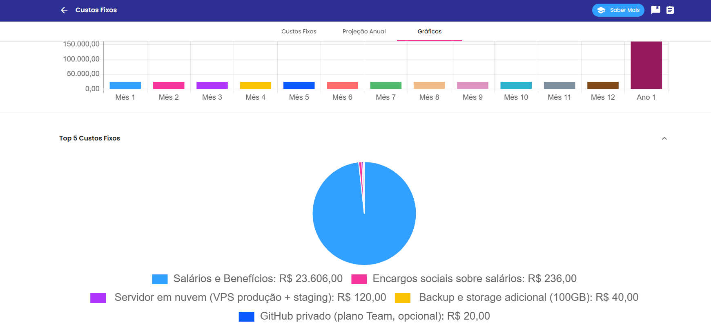
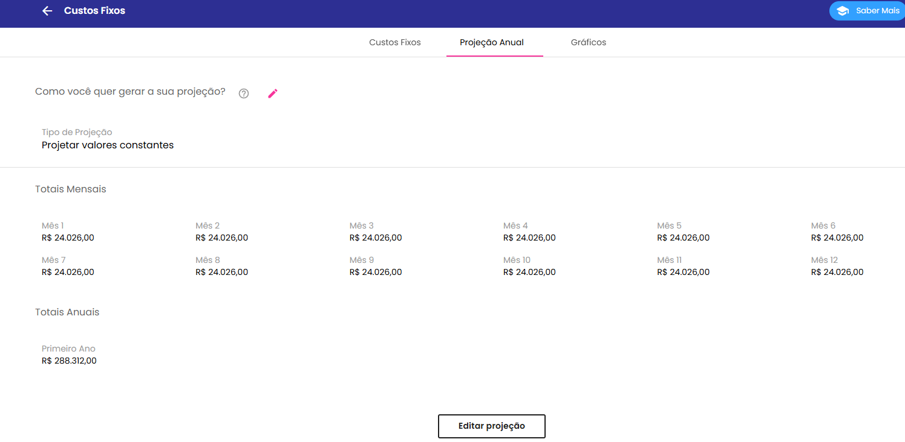
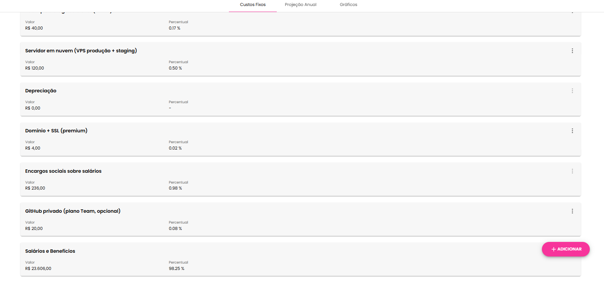
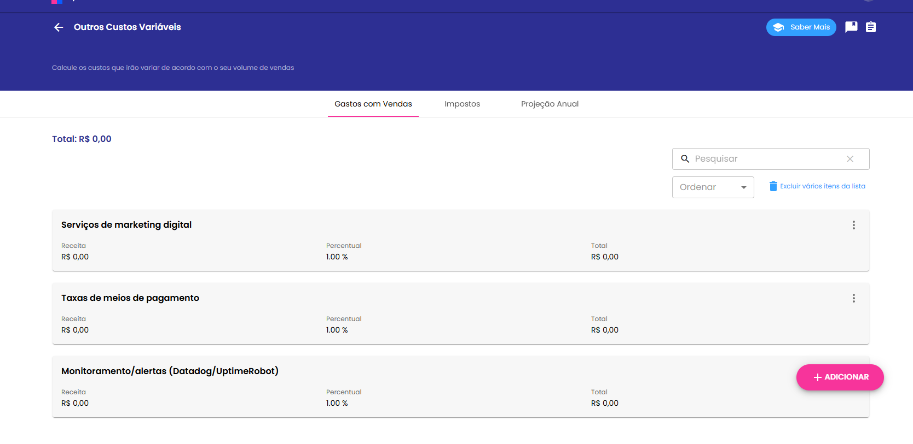
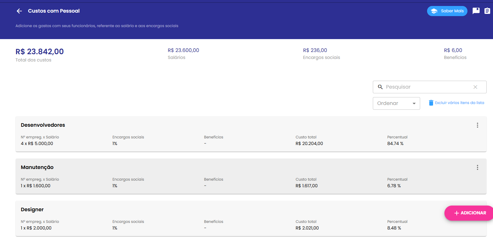

# Estudo de Custos e Despesas — Projeto Gestum

Este documento apresenta o levantamento sucinto dos principais custos e despesas relacionados ao produto/serviço do time, conforme orientações do Lean Canvas e da disciplina de Custos e Tributos.  

---

## 📊 Classificação de Custos e Despesas

### 🔹 Despesas Fixas
Gastos administrativos e de infraestrutura que ocorrem mensalmente, independentemente do uso do sistema.

| Item                              | Tipo      | Natureza   | Valor (R$) | Premissa |
|----------------------------------|-----------|------------|------------|----------|
| Servidor em nuvem (VPS produção + staging) | Fixa | Despesa indireta | 120/mês | Plano VPS básico em nuvem |
| Backup e storage adicional (100GB) | Fixa | Despesa indireta | 40/mês | Espaço dedicado para segurança dos dados |
| Domínio + SSL (premium) | Fixa | Despesa indireta | 50/ano (~4/mês) | Let’s Encrypt grátis, pago apenas premium |
| GitHub privado (plano Team, opcional) | Fixa | Despesa indireta | 20/mês | Plano para colaboração privada |

**Total mensal:** ~R$ 184/mês  
*(ou R$ 164/mês se não utilizar GitHub pago)*

---

### 🔹 Despesas Variáveis
Gastos administrativos que aumentam conforme a escala ou necessidade de serviços externos.

| Item                              | Tipo      | Natureza   | Valor (R$) | Premissa |
|----------------------------------|-----------|------------|------------|----------|
| Monitoramento/alertas (UptimeRobot/Datadog) | Variável | Despesa indireta | 50/mês (se contratado) | Apenas em caso de monitoramento avançado |
| Licenças adicionais (storage, email, plugins) | Variável | Despesa indireta | Sob demanda | Depende da necessidade |
| Serviços externos (APIs de autenticação, email/SMS) | Variável | Despesa direta | ~0,10–0,30 por envio | Custos unitários variáveis conforme volume |

---

### 🔹 Custos Fixos
Recursos de desenvolvimento e manutenção do sistema que não variam no curto prazo.

| Item                              | Tipo      | Natureza   | Valor (R$) | Premissa |
|----------------------------------|-----------|------------|------------|----------|
| Mão de obra inicial (MVP – 200h) | Fixo | Custo direto | 16.000 (projeto) | R$ 80/hora média |
| Manutenção de código (20h/mês) | Fixo | Custo direto | 1.600/mês | R$ 80/hora média |

---

### 🔹 Custos Variáveis
Custos que aumentam de acordo com a quantidade de clientes ou uso do sistema.

| Item                              | Tipo      | Natureza   | Valor (R$) | Premissa |
|----------------------------------|-----------|------------|------------|----------|
| Escalabilidade de servidores (instâncias extras) | Variável | Custo indireto | +80 a 150/mês por instância | Necessário em caso de aumento de tráfego |
| Armazenamento de documentos/certificados (S3/MinIO) | Variável | Custo direto | ~0,12/GB/mês | Caso seja necessário migrar do VPS |
| Suporte sob demanda (extra) | Variável | Custo direto | 80/hora | Além das 20h fixas de manutenção |

---

## 📌 Resumo e Premissas

- **Taxa horária considerada:** R$ 80/hora para desenvolvimento e suporte.  
- **Servidor base:** R$ 120/mês garante ambiente de produção e staging.  
- **Armazenamento inicial incluso no VPS**, expansão prevista para S3/MinIO conforme escala.  
- **Custos de serviços externos** (e-mail, SMS, APIs) projetados de forma variável por unidade de consumo.  

---

## 📷 Registro no PNBOX
Os mesmos itens listados neste estudo foram registrados no PNBOX.  

### Evidências (prints/IDs)

  
  
  
  

---

## 📂 Referência
Este arquivo está localizado em:  
`/docs/custos_estudo.md`  

Consulte também o **README.md**, atualizado com a seção de custos e link direto para este documento.
